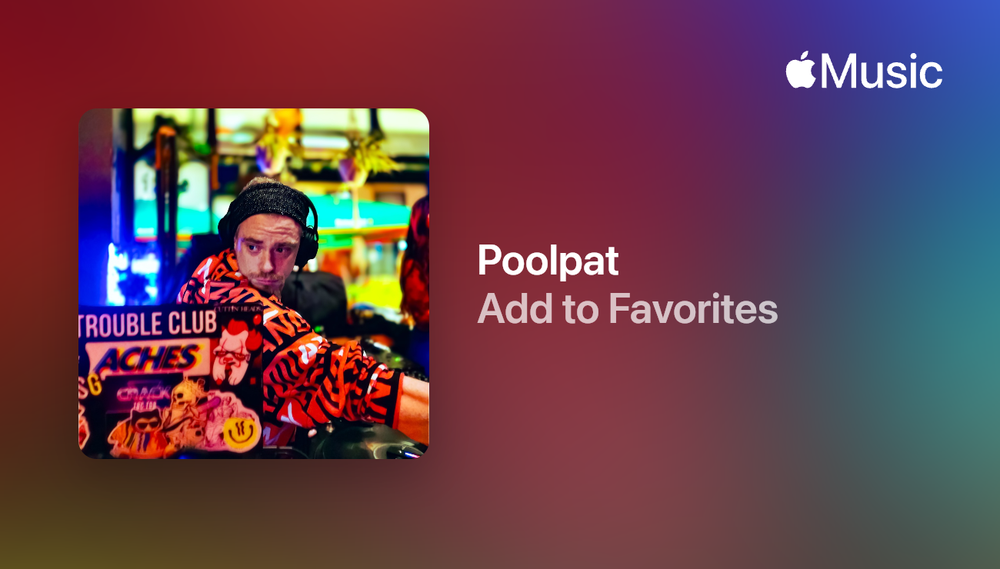

# Poolpat — Cork Trip-Hop

**[→ Listen, read, connect](https://thepoolpat.github.io/poolpat-portfolio/)**

Live play stats, full discography, and liner notes across SoundCloud, Spotify,
and Apple Music. All streaming and social links via [ffm.bio/poolpat](https://ffm.bio/poolpat).

---

Source for the artist site. Developer setup notes: [docs/DEVELOPMENT.md](docs/DEVELOPMENT.md).
